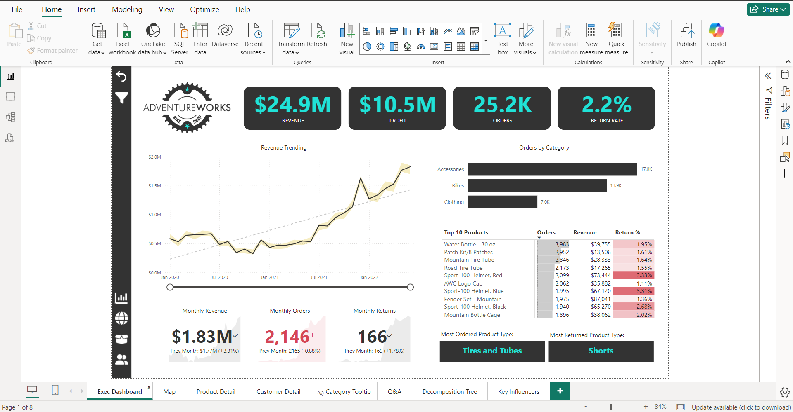
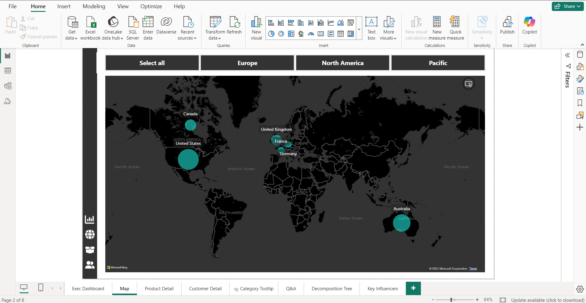
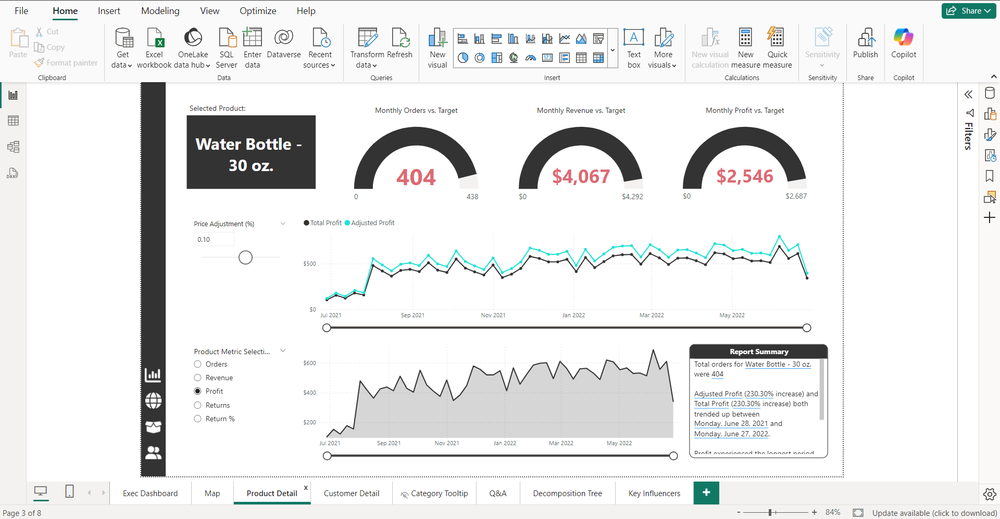
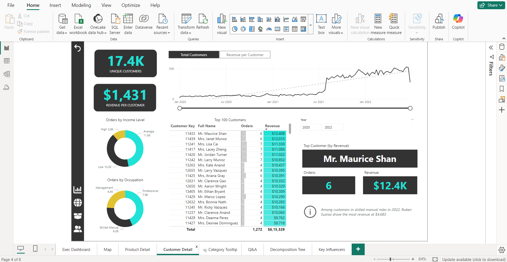

# Adventure-Works-Ecommerce-Analytics
Project Overview
This project analyzes sample data from Adventure Works, an imaginary e-commerce company. It reshapes the data and provides insights into various business aspects through interactive dashboards, geographical maps, and detailed visualizations.

Key Features

Main Dashboard:
Displays key metrics like total sales, profits, losses, and the most sold products.
Highlights performance trends over time.

Geographical Maps:
Visualize sales and customer locations on an interactive map.
Identify regions with the highest sales or most active customers.

Product Analysis:
In-depth insights into product performance, categories, and profitability.

Customer Insights:
Understand customer behavior, purchase patterns, and segmentation.

Other Visuals:
Additional charts and KPIs to provide a holistic view of the business.

Dataset Details
The dataset used in this project is a sample CSV file representing Adventure Works' sales data. It includes:

Products: Names, categories, and sales quantities.
Customers: Demographic and geographic information.
Sales: Date, revenue, profit, and loss details.
Regions: Country and location data for geographical mapping.

How to Use
Clone or download this repository: git clone https://github.com/Ajeeetsingh/Adventure-Works-Ecommerce-Analytics/tree/main.git

Open the .pbix file in Power BI Desktop.
Navigate through the various dashboard pages to explore insights.

Preview
Here are a few previews of the dashboards and visualizations included in the project:

Main Dashboard: 

Geographical Map: 

Product Analysis: 

Product Analysis: 

Dataset
The data source file used for this project is included in the repository:

File: data/
Description: All CSV files in this directory contain sales, customer, product, and region data for the Adventure Works e-commerce company.
Power BI File
The main Power BI dashboard file is included for direct exploration:

File: Dashboard/adventure_works_dashboard.pbix
Description: This .pbix file contains all the visualizations and analysis. Open it in Power BI Desktop to view and interact with the dashboards.

Contact
Feel free to reach out for questions, feedback, or collaboration:

Email: ajeetsingh7632@gmail.com
LinkedIn: https://www.linkedin.com/in/ajeet-singh-66810616a/
	
